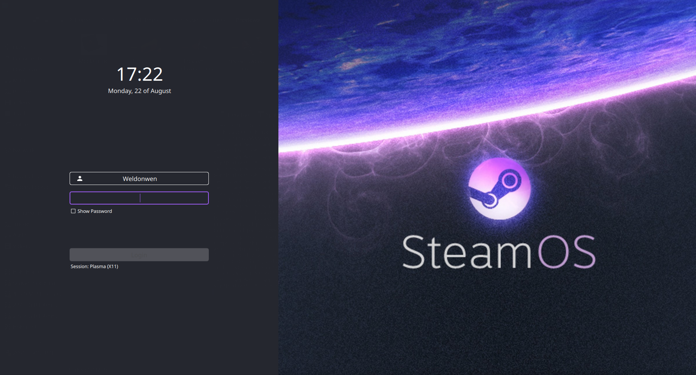

# SteamOS Sugar theme for SDDM

### Dependencies

[`sddm >= 0.18.0`](https://github.com/sddm/sddm), [`qt5 >= 5.11.0`](http://doc.qt.io/qt-5/index.html), [`qt5-quickcontrols2 >= 5.11.0`](http://doc.qt.io/qt-5/qtquickcontrols2-index.html), [`qt5-svg >= 5.11.0`](https://doc.qt.io/qt-5/qtsvg-index.html)

### Installing the theme

[Download the tar archive](https://www.opendesktop.org/p/1272122) and extract the contents to the theme directory of SDDM *(change the path for the downloaded file if necessary)*:
```
$ sudo tar -xzvf ~/Downloads/sugar-dark.tar.gz -C /usr/share/sddm/themes
```
This will extract all the files to a folder called "sugar-dark" inside of the themes directory of SDDM.  

After that you will have to point SDDM to the new theme by editing its config file, preferrably at `/etc/sddm.conf.d/sddm.conf` *(create if necessary)*. You can take the default config file of SDDM as a reference: `/usr/lib/sddm/sddm.conf.d/default.conf`.  

In the `[Theme]` section simply add the themes name: `Current=sugar-steamOS`. Also see the [Arch wiki on SDDM](https://wiki.archlinux.org/index.php/SDDM).

### Legal Notice

Copyright (C) 2018 Marian Arlt.  

Sugar Dark is free software: you can redistribute it and/or modify it under the terms of the GNU General Public License as published by the Free Software Foundation, either version 3 of the License, or (at your option) any later version.  

Sugar Dark is distributed in the hope that it will be useful, but WITHOUT ANY WARRANTY; without even the implied warranty of MERCHANTABILITY or FITNESS FOR A PARTICULAR PURPOSE. See the GNU General Public License for more details.  

You should have received a copy of the GNU General Public License along with Sugar Dark. If not, see <https://www.gnu.org/licenses/>.

[Mockup psd created by Qeaql-studio - Freepik.com](https://www.freepik.com/free-photos-vectors/mockup)

### Motivate a developer

From Marian Arlt: \
In the past years I have spent quite some hours on open source projects. If you are the type of person who digs attention to detail, know how much work is involved in it and/or simply likes to support makers with a coffee or a beer I would greatly appreciate your donation on my [PayPayl](https://www.paypal.me/marianarlt) account.  
Alternatively downloading my themes directly from opendesktop or with the kde sddm system settings module will at least help me a little to be able to attend your issues and requests.  
Please consider helping developers you think are worth a penny or two, literally.
